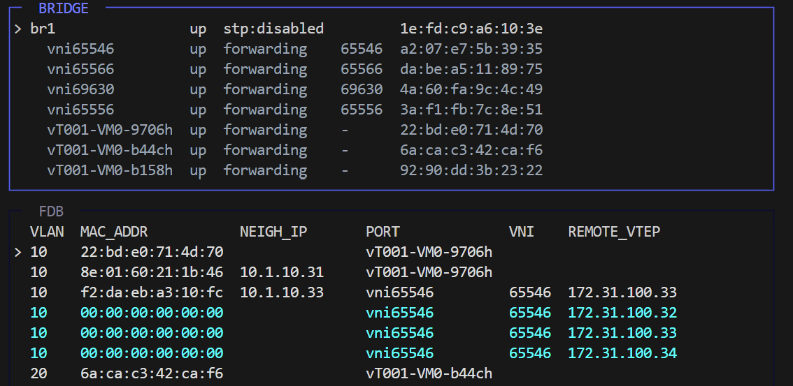

# vxmon - Visual eXtensible MONitor
**Visual eXtensible MONitor** (`vxmon`) is a TUI-based visualization tool designed for network engineers to monitor and troubleshoot Linux network namespaces, bridge, VRFs, and VXLAN states. It transforms complex kernel networking data into a clear, structured, and real-time interface.

**Visualizes complex network topologies** by aggregating distributed network stacks into a single terminal view, allowing engineers to track forwarding activity and state changes with high precision.

## Features
- **Real-time Visualization**: Displays FDB, neighbor (ARP/NDP), and routing tables with automated change highlighting using Netlink subscriptions.
- **Automated Discovery**: Identifies network namespaces automatically through `nsfs` mounts and `/proc` filesystem anallysis.
- **Unified Monitoring**: Provides a full-screen, interactive interface to manage and observe multiple namespaces and VRF instances simultaneously.



## Requirements
- Linux
- Go 1.26.0 or later
- Access to netlink and `/proc`

`vxmon` can run with limited permissions, but visibility may be partial. To inspect multiple namespaces, run it with sufficient privileges for your environment.

## Build
To build a binary:
```bash
git clone https://github.com/msstnk/vxmon.git
cd vxmon
go build -ldflags="-s -w" ./cmd/vxmon
```

Alternatively, you can build and run `vxmon` in a containerized environment:
```bash
sudo docker run --rm \
    -u $(id -u):$(id -g) \
    -v "$PWD":/app \
    -w /app \
    -e HOME=/tmp \
    -e CGO_ENABLED=0 \
    golang:1.26.0-alpine \
    go build -ldflags="-s -w" ./cmd/vxmon
```

## Keybindings
- `q`, `Ctrl+C`: quit
- `Tab`: switch focus between the top and bottom panes
- `Left`, `Right`: switch top-mode or bottom-mode depending on focus
- `Up`, `Down`: move selection
- `PgUp`, `PgDn`: move by one visible page
- `Home`, `End`: jump to first or last item
- `.` , `,`: move to next or previous child interface in bridge/VRF views
- `d`: toggle detailed view
- `t`: cycle the top-pane height
- `h`, `?`: show help

## Runtime Notes
- Namespace discovery combines `nsfs` mount inspection with `/proc` scanning.
- Route, neighbor, and link changes are consumed through netlink subscriptions.
- Process and interface-rate data are refreshed periodically from `/proc`.
- Bridge STP and bridge-port states are retrieved via Netlink API across all namespaces.

## Limitations
- Development is active and the tool may be unstable. Use with caution in production environments.
- No unit tests or integration tests currently exist.
- Tested primarily on Debian 13 with Linux 6.12 amd64.
- Some edge cases in netlink handling and namespace discovery may not be fully covered.

## References
Special thanks to the authors and maintainers of these excellent tools and libraries.

- `bmon` - reference code and inspiration: <https://github.com/tgraf/bmon>
- `netlink`: <https://github.com/vishvananda/netlink>
- `netns`: <https://github.com/vishvananda/netns>
- `Bubble Tea`: <https://github.com/charmbracelet/bubbletea>
